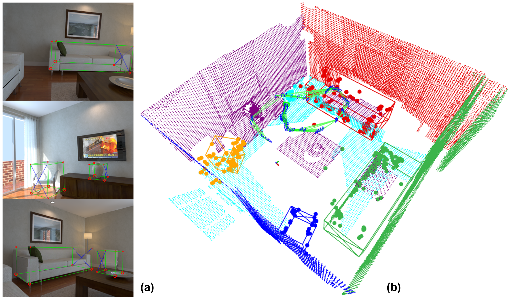
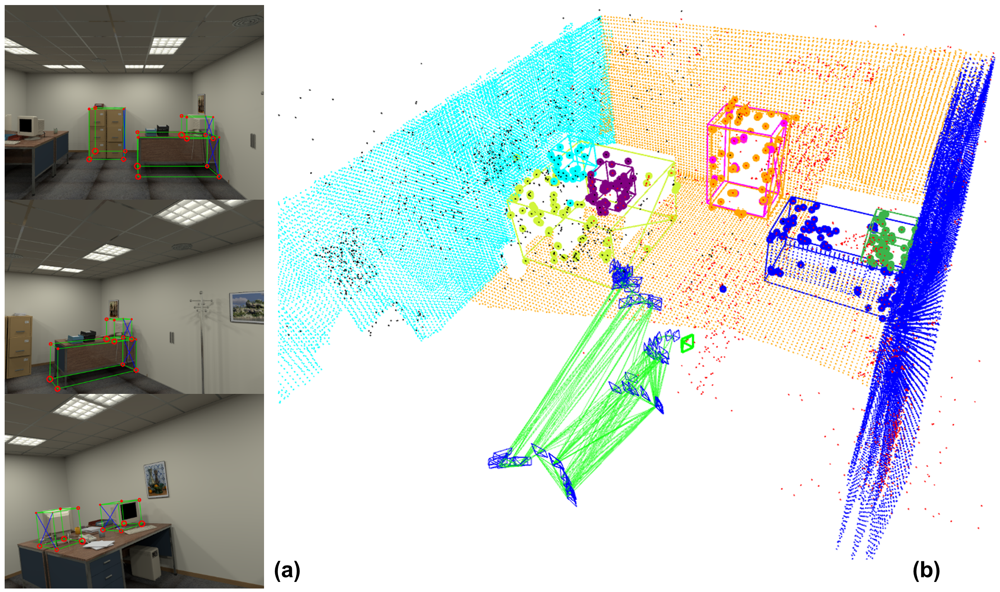

# Structure SLAM with Points, Planes, and Objects

**Related Paper:**  

+ Benchun Zhou, Maximilian Gilles, Yongqi Meng. **Structure SLAM with Points, Planes, and Objects**[J]//Advanced Robotics 36.20 (2022): 1060-1075. [[**Link**](https://www.tandfonline.com/doi/full/10.1080/01691864.2022.2123253)] [[**PDF**](./README_Picture/2022_Advanced_Robotics_Publication.pdf)]  [[**Slide**](./README_Picture/2022_Advanced_Robotics_Slide.pdf)]
 [[**Youtube**](https://youtu.be/nBbGTFeUh88)] [[**Bilibili**](https://www.bilibili.com/video/BV1JM4y167uT)]

+ If you use the code in your academic work, please cite the above paper. 

<div align=center></div>
<div align=center></div>

## 1. Prerequisites 
* Ubuntu (18.04.5)
* CMake (3.10.2)
* Eigen (3)
* OpenCV (3.2.0)
* PCL (1.8.1)
* Note: the code builds on the top of [**ORB-SLAM2**](https://github.com/raulmur/ORB_SLAM2), if you meet compile problems, please refer to [**ORB-SLAM2**](https://github.com/raulmur/ORB_SLAM2).


## 2. Running
Clone the repository:
```
    git clone https://github.com/benchun123/point-plane-object-SLAM.git
```
build the project: 
```
    chmod +x build.sh
    ./build.sh  
```

Download dataset: 

the open-source code runs on a [living room kt-2 sequence](https://bwsyncandshare.kit.edu/s/nH8QTiZXceKnE6c) of [ICL NUIM RGB-D Dataset](https://www.doc.ic.ac.uk/~ahanda/VaFRIC/iclnuim.html). A copy of the dataset can also be found at [Google Drive]([https://bwsyncandshare.kit.edu/s/nH8QTiZXceKnE6c](https://drive.google.com/drive/folders/1FwkxgzuxQNrRuaUcgMm9d3iPoDfiU2tn?usp=sharing))

Run it as follows:
```
    ./build/mono_icl_test ~/path/to/icl_dataset

```

## 4. Note 
1. The main contribution of the code is to add cuboid and plane objects in tracking and optimization process, thus we add two classes **MapCuboid** and **MapPlane** together with several functions, such as: 
    +    void DetectCuboid(KeyFrame *pKF);
    +    void AssociateCuboids(KeyFrame *pKF);
    +    void DetectPlane(KeyFrame *pKF);
    +    void AssociatePlanes(KeyFrame *pKF);
    +    void AssociatePlanesAndCuboids(KeyFrame *pKF);
    +    void static LocalBACameraPlaneCuboids(KeyFrame *pKF, bool *pbStopFlag, Map *pMap, bool fixCamera = false, bool fixPoint = false); 
    + please check "Tracking.h" and "Optimizer.h" for more details. 
2. In this code, we read offline 3D cuboid, the objects can be detected online. 
3. In this code, we use OrganizedMultiPlaneSegmentation from PCL library to detect planes from depth image, it can be replaced by other methods. 

## 5. Acknowledgement 

Thanks for the great work:  [**ORB-SLAM2**](https://github.com/raulmur/ORB_SLAM2), [**Cube SLAM**](https://github.com/shichaoy/cube_slam), and [**SP-SLAM**](https://github.com/fishmarch/SP-SLAM)

+ Mur-Artal R, Tardós J D. **Orb-slam2: An open-source slam system for monocular, stereo, and rgb-d cameras**[J]. IEEE Transactions on Robotics, 2017, 33(5): 1255-1262. [[**PDF**](https://arxiv.org/abs/1610.06475)], [[**Code**](https://github.com/raulmur/ORB_SLAM2)]
+ Yang S, Scherer S. **Cubeslam: Monocular 3-d object slam**[J]. IEEE Transactions on Robotics, 2019, 35(4): 925-938. [[**PDF**](https://arxiv.org/abs/1806.00557)], [[**Code**](https://github.com/shichaoy/cube_slam)]
+ Zhang, X., Wang, W., Qi, X., Liao, Z., & Wei, R. **Point-plane slam using supposed planes for indoor environments**[J].  Sensors, 2019, 19(17), 3795. [[**PDF**](https://www.mdpi.com/1424-8220/19/17/3795)], [[**Code**](https://www.mdpi.com/1424-8220/19/17/3795)]
